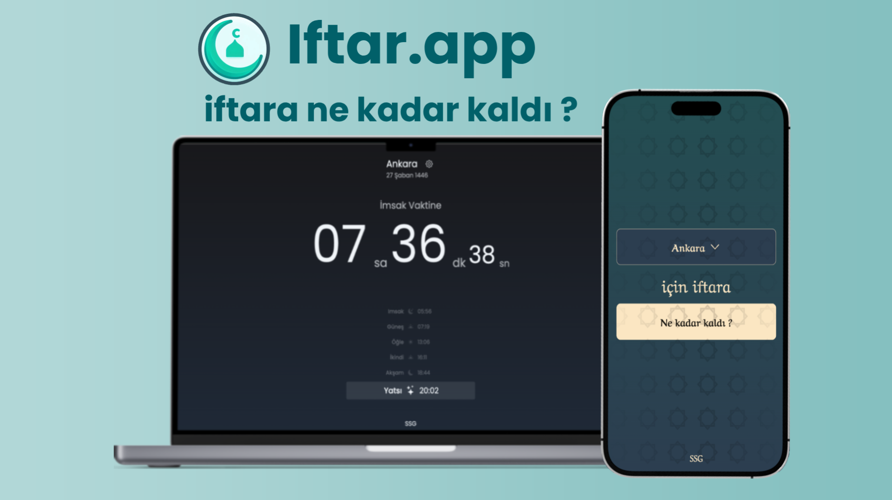

# Iftar.app

A beautiful and modern Vue.js application that displays accurate prayer times with a focus on Ramadan's iftar and sahur times. The app features multiple themes, city selection, and a countdown timer to help Muslims track prayer times throughout the day.

**🌐 Live at: [https://iftar.app](https://iftar.app)**



## Features

- 🕌 Accurate prayer times using the Aladhan API
- ⏱️ Real-time countdown to iftar and sahur times
- 🌙 Hijri date display
- 🏙️ City selection for locations in Turkey
- 🎨 Multiple beautiful themes (Islamic, Ottoman, Seljuk, Modern, Dark, Digital, SSG, Dune)
- ⚙️ Customizable settings (show/hide seconds, dates)
- 📱 Fully responsive design for all devices
- 🔄 Automatic updates of prayer times

## To-Do List

- [ ] Support for international locations
- [ ] Add language options (currently Turkish only)
- [ ] Implement PWA features for app installation

## Tech Stack

- Vue 3 + Vite
- Pinia
- Tailwind CSS

## Getting Started

### Prerequisites

- Node.js (v14 or higher)
- npm

### Installation

1. Clone the repository
```sh
git clone https://github.com/yourusername/iftar-time-app.git
cd iftar-time-app
```

2. Install dependencies
```sh
npm install
```

3. Start the development server
```sh
npm run dev
```

4. Open your browser and navigate to `http://localhost:5173`

### Building for Production

```sh
npm run build
```

The built files will be in the `dist` directory.


## API

This app uses the [Aladhan API](https://aladhan.com/prayer-times-api) to fetch prayer times. The API is free to use and does not require authentication.

## Contributing

Contributions are welcome! Please feel free to submit a Pull Request.

1. Fork the repository
2. Create your feature branch (`git checkout -b feature/amazing-feature`)
3. Commit your changes (`git commit -m 'Add some amazing feature'`)
4. Push to the branch (`git push origin feature/amazing-feature`)
5. Open a Pull Request

## License

This project is licensed under the MIT License - see the LICENSE file for details.

## Acknowledgments

- [Aladhan API](https://aladhan.com/prayer-times-api) for providing prayer times data
- [Tailwind CSS](https://tailwindcss.com/) for styling
- [Vue.js](https://vuejs.org/) for the frontend framework
